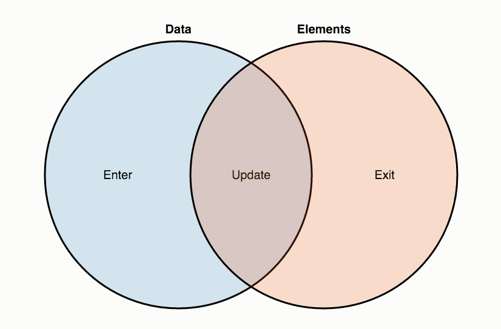
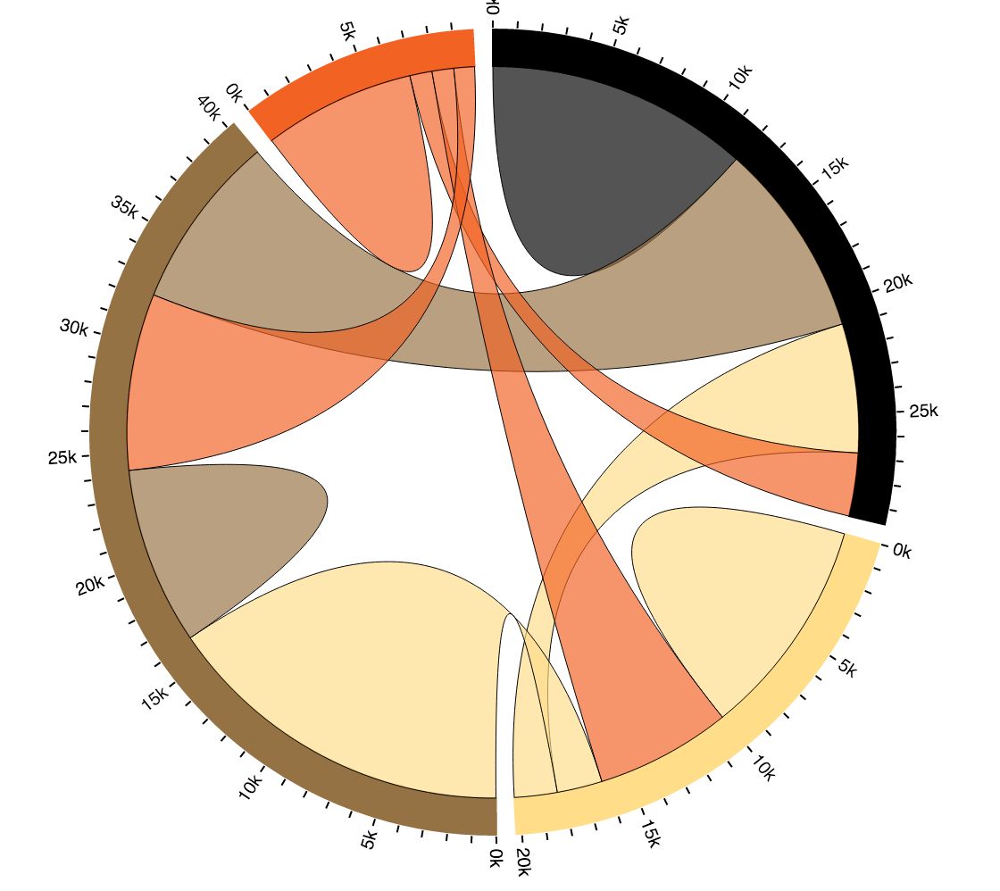
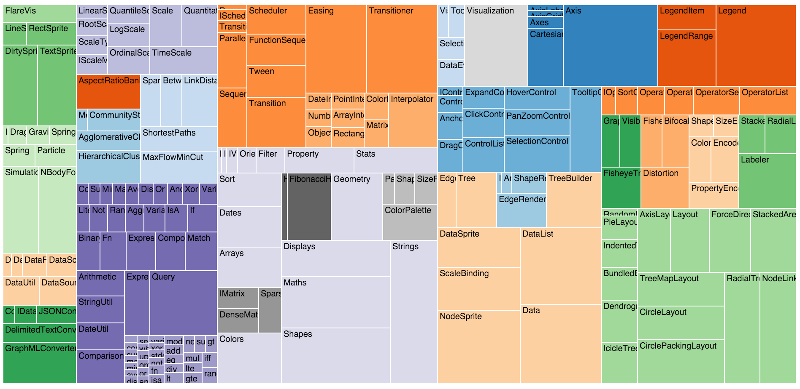

#README: Adventures with D3


**Overview**: D3.js is a JavaScript library for manipulating documents based on data. D3 helps you bring data to life using HTML, SVG, and CSS. D3's emphasis on web standards gives you the full capabilities of modern browsers without tying yourself to a proprietary framework, combining powerful visualization components and a data-driven approach to DOM manipulation.

&nbsp;&nbsp;&nbsp;

# Using the d3-rails gem

Using the gem itself is ridiculously easy. From [their website](https://github.com/iblue/d3-rails):

&nbsp;

Add this line to your Gemfile:

```ruby
gem "d3-rails"
```
Please note that D3 is provided via the asset pipeline and you do not need to copy their files into your application. Rails will get them from d3-rails automatically.

Then add it to your manifest file, most probably at app/assets/javascripts/application.js:
```
//= require d3
```

***

# Using d3 itself

is a whole other story...

d3 had several features that were particularly hard for me to wrap my mind around:

1. SVGs
2. data joins
3. layouts

Let's look at these in turn.

####SVGs

SVGs stand for Scalable Vector Graphics. Unlike images like PNGs or JPGs, which are composed of pixels and typically lose quality when they are scaled up, SVGs are composed of mathematically-defined shapes - basically, you define the mathematical rules, and they hold regardless of the zoom. SVGs are supported by all major browsers to some extent, and their flexibility makes them a good choice for visualizations.

But, SVGs have their own rules that are different from other HTML elements. You can style them with CSS, but certain properties are different; for instance, an SVG shape usually has a fill instead of a background-color, and a stroke instead of a line color. They have a different kind of a div called a group (abbreviated g), and my experience was that generally you need to do a lot more math to use them than you would for using and positioning HTML elements.

The good news is that you don't *have* to use SVGs in order to use d3 - the library works with HTML elements as well. But some of the cooler charts are much better suited to SVG, so I spent a good part of my time trying to wrap my head around those.

####data joins

This is the core of d3 - binding DOM elements to data. Suppose we want to an array of data, like:
```javascript
my_data = [2,5,4,7];
```

And we want to make some circles that have radiuses proportional to those numbers. The d3 code to make that work looks like:

```javascript
svg.selectAll("circle")
    .data(my_data)
  .enter().append("circle")
    .attr("r", function(d) { return d });
```

A lot of that will look unfamiliar, but even the first line is surprising. Why are we trying to select all of the circles? We haven't even made any circles yet! It's not going to find anything.

And sure enough, it's not. It's just that d3 data-binding begins with binding data to a selection, even if the selection is empty, because really what you're saying is, "d3, I *want* circles to correspond with my data, even if they don't currently."

d3 looks at that desired correspondence and basically divides the situation into three categories:

1. update: data is already tied to a DOM element.
2. enter: new data needs to be tied to DOM elements that don't exist - that is the situation described above
3. exit: DOM elements exist that are no longer tied to data. Typically these will be removed.

Only the second describes our current situation, and most static visualizations (update and exit are more relevant when transitioning between visualizations). The reason for this wacky way of thinking about things is that it generalizes extremely well - once you get the hang of it, you can describe any situation with this vocabulary.

d3 offers this image, which is may help if you're a visual person:



So to paraphrase the code above: bind the data to circles; in cases where there is data but no circles (which is every case), add a circle with the radius equal to the bound data element, d.

Crystal clear, right?

Note that the code above doesn't actually move the centers of the circles and so if you were actually to run it, they'd overlap (I just wanted to keep things simple).

####layouts

d3 is looking out for you and it knows you probably don't like to do all of the nasty svg calculations by hand in order to know where shapes ought to be. So it offers a set of layouts that basically take a set of input data and calculate the sizes and positions of certain standard shapes for you.

For instance, the chord layout (the chart I did) takes a square matrix, which is a fancy way of saying it takes a nested array with the same number of rows and columns (just like sudoku, 256, tic tac toe, etc.).



Or the treemap layout, which helps you understand how small parts comprise a whole.



There are many other layouts as well. While the layouts are ultimately massive timesavers, they still have their own interfaces to learn, and it can take a while to understand what kind of data they ought to take as input. Lots of d3 visualizations are tree-based and I wish I'd spent more time exploring that data structure before this tutorial.


# Wrapping up

While I've talked primarily about some of the parts of d3 I struggled with, the library has a ton of positives. First, it's just powerful - going to the homepage of https://d3js.org/ or looking at some of the many online galleries gives you a sense of what amazing visualizations you can make with the library. Second, the documentation is fairly comprehensive, even if it's hard to understand. And third, there are many, many examples, both on the site and around the web. In fact, the site itself has dozens of tutorials that you can go through that I wish in retrospect I'd taken greater advantage of.

So despite some of the challenges described above, I enjoyed working with d3 and will be back at it again soon. Hopefully I haven't scared you away and you will too!